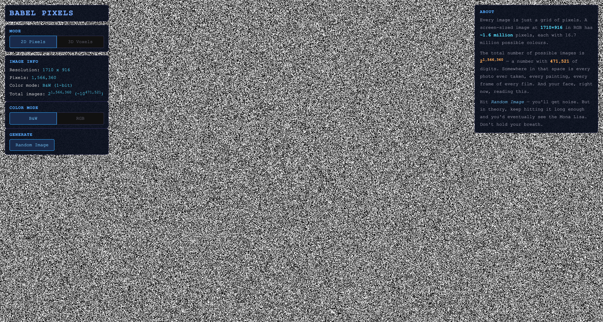
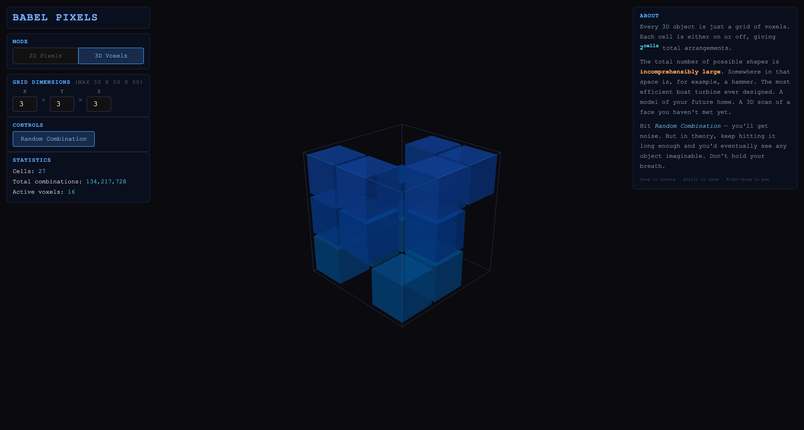
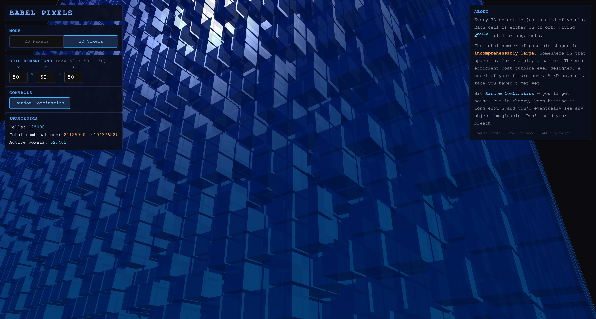

# Babel Pixels

An experiment to visualise the sheer scale of combinatorial spaces — through 2D pixel images and 3D voxels.






## The idea

Every image is just a grid of pixels. Every 3D object is just a grid of voxels. Each cell is either on or off (or one of 16.7 million colours), giving an astronomical number of total arrangements.

| Grid | Cells | Combinations | At 10B/s |
|------|-------|-------------|----------|
| 3x3x3 | 27 | 134,217,728 | ~0.01 seconds |
| 5x5x5 | 125 | ~4.25 x 10^37 | ~1.35 x 10^20 years |
| 50x50x50 | 125,000 | 2^125,000 | incomprehensible |
| 1920x1080 RGB | 6.2M | 256^6,220,800 | more digits than atoms in the universe |

Somewhere in the 3D space is, for example, a hammer. The most efficient boat turbine ever designed. A model of your future home. In the 2D space — every photo ever taken, every painting, every frame of every film. And your face, right now, reading this.

## Features

### 2D Pixels mode
- **Full-screen random image generation** — B&W (1-bit) or RGB (24-bit)
- **Instant generation** using `crypto.getRandomValues()`
- Shows resolution, pixel count, and the total number of possible images

### 3D Voxels mode
- **Configurable grid** — any X x Y x Z dimensions (up to 50 x 50 x 50)
- **Random combination** — generates a random voxel arrangement instantly
- **3D visualisation** — Three.js with instanced rendering, orbit controls
- **Stats** — cell count, total combinations, active voxels

## Usage

Serve the directory over HTTP and open in a browser:

```sh
npx serve .
```

Or any other static file server. Switch between 2D and 3D modes, hit **Random** and contemplate infinity.

## How it works

**3D mode:** Each voxel cell is on or off. A random combination is generated using `crypto.getRandomValues()` and rendered as instanced 3D cubes via Three.js.

**2D mode:** Each pixel is assigned random colour values, producing a unique image from the vast space of all possible images at that resolution.
